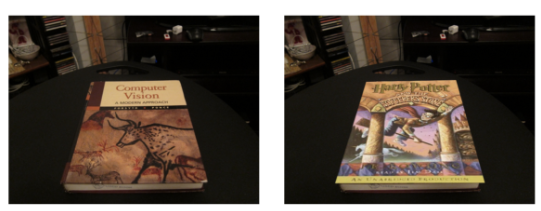

# Description

This is an **Augmented Reality** application using *planar homographies*.

 

*Planar homography* is a warp operation that maps pixel coordinates from one camera frame to another of the same points. This usually raises a problem in which 
rdinary least squares is not possible to be used as the projective geometry in this case is of the form x = λHx′. We can bypass such dilemma by applying *Direct Linear Transform*, where the equation is rewritten into homogeneous equations that are solvable using standard least squares method.  

 

There are 2 major parts in this project:
1. Convert a cover of any book into a cover of a HarryPotter book. These are the steps:
	- Feature detection, description, and matching: find corresponding point pairs between 2 images using **FAST detector** (*detectFASTFeature* function in Matlab)  with **BRIEF descriptor** (*computeBrief* function). In order to better see these points, adjust threshold parameter on *matchFeature()* function) 
	- Compute Homography: estimate the planar homography from a set of matched point pairs.
	- Homography Normalization to improve the stability of the solution.
	- Use **RANSAC algorithm** - an iterative method for estimating a mathematical model from a dataset that contains outlier, to fit model to noisy data. 
	- HarryPotterize a book: detect a cover of any book and change it to Harry Potter book cover.

2. Create an Augmented Reality application:
	- HarryPotterize a video ar *source.mov* onto the video *book.mov*. 
	- Use *imresize* or crop each frame to fit the video onto the video. 
	- The video is played on a book cover of another video. 

 