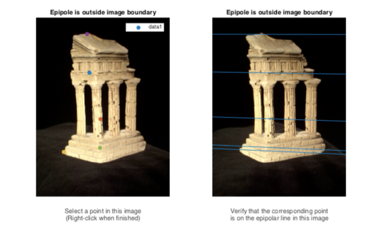
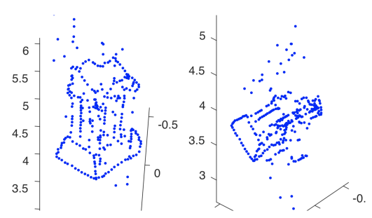
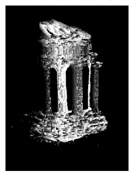

# Description
One of the major areas of computer vision is 3D reconstruction of an environment based on given 2D images of its surroudings. This project focuses on **sparse reconstruction** and **dense reconstruction**.

## Sparse reconstruction
**Sparse reconstruction** typically contains a number of points and uses them to describe the objects in question. These are the steps:
- Use **eight point algorithm** to estimate the fundamental matrix.  

- Find epipolar correspondences by finding point pairs in a pair of stereo images. 
- Compute the essential matrix - a 3x3 matrix that relates corresponding points in stereo images assuming that the cameras satisfy the pinhole camera model.
- Triangulate pairs of 2D points in the images to a set of 3D points.  

## Dense reconstruction
**Dense reconstruction** is more detailed and fine-grained compared to **Sparse reconstruction**. These are the steps:
- Compute rectification matrices - a transformation process used to project images onto a common image plane.  

- Perform dense window matching to find per pixel density by creating a disparity map from a pair of rectified images.  

- Create a depthmap from a disparity map